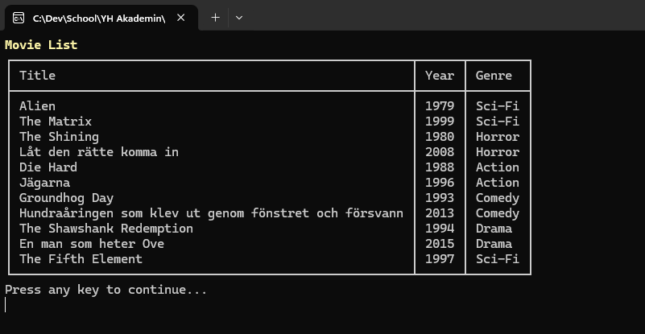
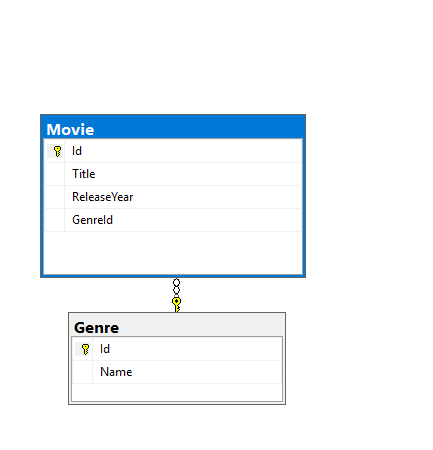
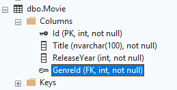

# ReelRegistry

A C# console application for managing a movie registry in SQL Server. The application uses ADO.NET for database access and Spectre.Console for its menus and tables.

## Features

- View all movies with their release year and genre.
- Search for movies by genre.
- Add a movie and select an existing genre from the database.
- Remove a selected movie.

## Movie list

The application displays sample movies with their release years and genre names from the related database tables.



## Requirements

- .NET 10 SDK
- SQL Server accessible as `localhost` with Windows authentication
- A database named `ReelRegistryDb`

## Database setup

Use [DatabaseSetup.sql](docs/DatabaseSetup.sql) to create the database before running the application:

1. Open SQL Server Management Studio and connect to your SQL Server instance.
2. Open `docs/DatabaseSetup.sql` using **File → Open → File**.
3. Execute the full script using **Execute** or **F5**.

The script creates `ReelRegistryDb`, the `Genre` and `Movie` tables, their foreign key relationship, five genres, and ten sample movies. It is intended for a fresh setup; run it once on a server where `ReelRegistryDb` does not already exist.

| Table | Columns |
| --- | --- |
| `Genre` | `Id` (int, primary key, identity), `Name` (nvarchar, not null) |
| `Movie` | `Id` (int, primary key, identity), `Title` (nvarchar(100), not null), `ReleaseYear` (int, not null), `GenreId` (int, foreign key, not null) |

The script creates a foreign key from `Movie.GenreId` to `Genre.Id`. Each movie must reference an existing genre, and multiple movies can share the same genre.

The seeded genres match the search menu: `Action`, `Comedy`, `Drama`, `Horror`, and `Sci-Fi`.

### Database relationship

The SQL Server diagram shows the relationship between the `Movie` and `Genre` tables.



### Movie columns

The table definition shows that `GenreId` is a foreign key and does not allow NULL values.



## Run the application

After setting up the database, check the connection string in `Data/Database.cs`:

```text
Server=localhost;Database=ReelRegistryDb;Trusted_Connection=True;TrustServerCertificate=True;
```

Update `Server` if you use a named instance or another server address. The Windows account running the application must have access to the database.

Open a terminal in the project directory and run:

```powershell
dotnet run
```

NuGet dependencies are restored automatically. Use the arrow keys to navigate and Enter to select. Scroll down to reveal additional choices in longer selection menus.

## Project structure

| File or folder | Responsibility |
| --- | --- |
| `Program.cs` | Starts the application |
| `Services/` | Coordinates menu choices and operations |
| `UI/` | Displays menus and tables and collects input |
| `Repositories/` | Reads and changes database records using ADO.NET |
| `Models/` | Represents movies and genres |
| `Data/` | Holds the database connection configuration |

Database access is separated from the user interface. Queries use `SqlConnection`, `SqlCommand`, and `SqlDataReader`. Search, insert, and delete operations use SQL parameters. Connections, commands, and readers are disposed through `using` declarations.

## Manual testing

With sample records in the database:

1. View all movies and check that each row includes its genre name.
2. Search by genre and check that only matching movies are displayed.
3. Add a movie using an existing genre, then view the list to confirm it appears.
4. Remove that movie, then view the list to confirm it is gone.
5. Select Exit to close the application.
